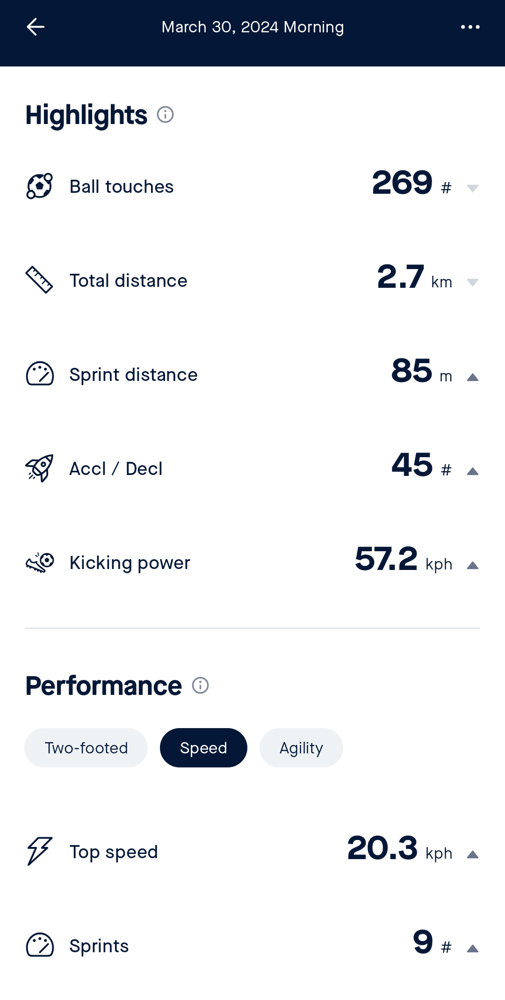

# GPS vs CityPlay Accuracy Analysis

## Description
As a physicist and data scientist, I rely on data-driven insights, but I also believe in validating them through rigorous testing. When it comes to evaluating my child's football performance, I rely on **CityPlay by Playermaker**, a sensor-based tracking system, rather than subjective coach opinions. After all, football is a team sport, and coaches have multiple players to oversee. CityPlay provides detailed performance metrics by using **motion sensors placed on the player's feet**, tracking movement, speed, and ball interactions throughout training sessions and games.


## Aim
While CityPlay provides a wealth of stats, I was particularly curious about the **accuracy of its max speed estimation**. Since the sensors are placed on the feet and rely on accelerometers, the speed estimation might be influenced by each player's unique leg length and movement mechanics. I wanted to verify how precise the speed tracking is, considering these factors. To do this, I repurposed an old **ATP Mini Photo Finder**—a device I originally used for geotagging photos years ago. Since this device generates downloadable GPS logs, it was a natural candidate for this test.

However, there was a key limitation: while the **ATP manual claims a 1 Hz logging rate**, in reality, it logs at **0.1 Hz** (one data point every 10 seconds). This meant that to properly measure max speed, my child had to **run for at least 15 seconds along a straight path**. Additionally, I wanted to generate a **heat map** of football activity during practice and games.

To conduct the test, we went to a football field, equipped both sensors, and tracked the session. Due to the **low sampling rate of the GPS logger**, most **KPIs such as total distance, average speed, number of sprints, and acceleration measurements are unreliable**, but for speed verification, we selected a **straight-line sprint from the field to the parking lot** lasting over 10 seconds. The results were as follows:

- **Max Speed from GPS**: 19.87 km/h
- **Max Speed from CityPlay**: 20.3 km/h

Despite the limitations, the results suggest that CityPlay's speed estimation is quite accurate, with a deviation of approximately 0.43 km/h (2.16%) compared to the GPS measurement. This project serves as an exploration of **sensor-based performance tracking** and highlights both the strengths and limitations of different tracking technologies.

## Features
- Parses **GPS logs** (supports `.txt` and `.log` files with NMEA sentences).
- Extracts **key performance metrics**:
  - **Total distance covered**
  - **Total session time**
  - **Average speed**
  - **Max speed**
  - **Acceleration statistics**
  - **Number of sprints (speed >15.1 km/h)**
- Generates a **heatmap** to visualize speed distribution.
- Uses **Haversine formula** to calculate distance between GPS points.
- Converts timestamps to **Eastern Time (ET)** for better readability.

## Installation

### 1. Clone the repository:
```bash
git clone https://github.com/your-username/gps-vs-cityplay.git
cd gps-vs-cityplay
```

### 2. Create a virtual environment:
```bash
python -m venv venv
source venv/bin/activate  # On macOS/Linux
venv\Scripts\activate     # On Windows
```

### 3. Install dependencies:
```bash
pip install -r requirements.txt
```

## Usage

### 1. Run the Streamlit app:
```bash
streamlit run gps_analysis.py
```

### 2. Upload GPS Data
- The app accepts **.txt** or **.log** files containing **NMEA 0183 sentences**.
- It automatically parses `$GPRMC` sentences for **latitude, longitude, speed, and time**.

### 3. View Performance Metrics
- The app displays calculated **statistics**.
- A **heatmap** shows speed variation across locations.


## Outputs & Visualizations

### **Key Metrics Table**
| Metric                  | Value  |
|-------------------------|--------|
| Total Distance (km)     | X.XX   |
| Total Time (hours)      | X.XX   |
| Average Speed (km/h)    | X.XX   |
| Max Speed (km/h)        | X.XX   |
| Max Acceleration (m/s²) | X.XX   |
| Min Acceleration (m/s²) | X.XX   |
| Number of Sprints       | X      |

### **Heatmap Example**
*(Generated using **Folium** & **Streamlit-Folium**)*
  

### **CityPlay App Readings**


## Limitations
- **Low GPS logging rate (0.1 Hz)** may lead to gaps in data.
- Speed estimation accuracy **depends on GPS hardware and sampling rate**.
- Heatmap granularity is **limited by GPS data points**.

## License
This project is licensed under the **MIT License**.

📂 gps-vs-cityplay
 ┣ 📂 docs/                  # Images
 ┣ 📂 gps_log/               # Sample GPS data
 ┣ 📜 gps_analysis.py        # Streamlit app
 ┣ 📜 requirements.txt       # Python dependencies
 ┗ 📜 README.md              # This file


